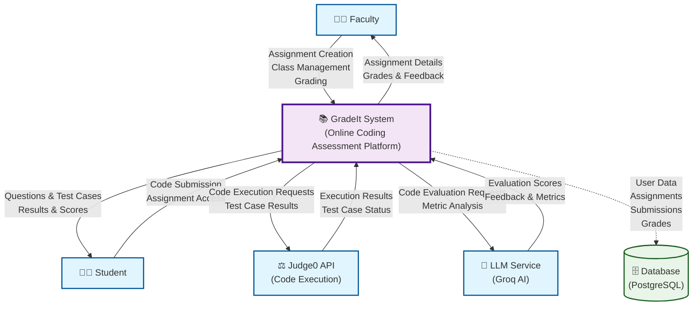

# DFD Level 0 - Context Diagram (Visual)

```mermaid
graph TD
    %% External Entities
    Faculty["👨‍🏫 Faculty"]
    Student["👨‍🎓 Student"]
    Judge0["⚖️ Judge0 API<br/>(Code Execution)"]
    LLM["🤖 LLM Service<br/>(Groq AI)"]
    
    %% Main System
    GradeIt["📚 GradeIt System<br/>(Online Coding Assessment Platform)"]
    
    %% Data Flows
    Faculty -->|"Assignment Creation<br/>Class Management<br/>Grading"| GradeIt
    Student -->|"Code Submission<br/>Assignment Access"| GradeIt
    GradeIt -->|"Assignment Details<br/>Grades & Feedback"| Faculty
    GradeIt -->|"Questions & Test Cases<br/>Results & Scores"| Student
    GradeIt -->|"Code Execution Requests<br/>Test Case Results"| Judge0
    Judge0 -->|"Execution Results<br/>Test Case Status"| GradeIt
    GradeIt -->|"Code Evaluation Requests<br/>Metric Analysis"| LLM
    LLM -->|"Evaluation Scores<br/>Feedback & Metrics"| GradeIt
    
    %% Data Stores
    GradeIt -.->|"User Data<br/>Assignments<br/>Submissions<br/>Grades"| Database[("🗄️ Database<br/>(PostgreSQL)")]
    
    classDef external fill:#e1f5fe,stroke:#01579b,stroke-width:2px
    classDef system fill:#f3e5f5,stroke:#4a148c,stroke-width:3px
    classDef database fill:#e8f5e8,stroke:#1b5e20,stroke-width:2px
    
    class Faculty,Student,Judge0,LLM external
    class GradeIt system
    class Database database
```