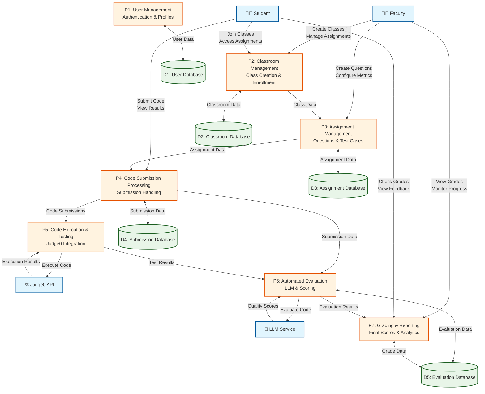

# DFD Level 1 - Main Processes (Visual)

```mermaid
graph TD
    %% External Entities
    Faculty["👨‍🏫 Faculty"]
    Student["👨‍🎓 Student"]
    Judge0["⚖️ Judge0 API"]
    LLM["🤖 LLM Service"]
    
    %% Main Processes
    P1["P1: User Management<br/>Authentication & Profiles"]
    P2["P2: Classroom Management<br/>Class Creation & Enrollment"]
    P3["P3: Assignment Management<br/>Questions & Test Cases"]
    P4["P4: Code Submission Processing<br/>Submission Handling"]
    P5["P5: Code Execution & Testing<br/>Judge0 Integration"]
    P6["P6: Automated Evaluation<br/>LLM & Scoring"]
    P7["P7: Grading & Reporting<br/>Final Scores & Analytics"]
    
    %% Data Stores
    D1[("D1: User Database")]
    D2[("D2: Classroom Database")]
    D3[("D3: Assignment Database")]
    D4[("D4: Submission Database")]
    D5[("D5: Evaluation Database")]
    
    %% External to Process Flows
    Faculty -->|"Create Classes<br/>Manage Assignments"| P2
    Faculty -->|"Create Questions<br/>Configure Metrics"| P3
    Faculty -->|"View Grades<br/>Monitor Progress"| P7
    Student -->|"Join Classes<br/>Access Assignments"| P2
    Student -->|"Submit Code<br/>View Results"| P4
    Student -->|"Check Grades<br/>View Feedback"| P7
    
    %% Process to Process Flows
    P2 -->|"Class Data"| P3
    P3 -->|"Assignment Data"| P4
    P4 -->|"Code Submissions"| P5
    P4 -->|"Submission Data"| P6
    P5 -->|"Test Results"| P6
    P6 -->|"Evaluation Results"| P7
    
    %% External Service Flows
    P5 -->|"Execute Code"| Judge0
    Judge0 -->|"Execution Results"| P5
    P6 -->|"Evaluate Code"| LLM
    LLM -->|"Quality Scores"| P6
    
    %% Data Store Flows
    P1 <-->|"User Data"| D1
    P2 <-->|"Classroom Data"| D2
    P3 <-->|"Assignment Data"| D3
    P4 <-->|"Submission Data"| D4
    P6 <-->|"Evaluation Data"| D5
    P7 <-->|"Grade Data"| D5
    
    classDef external fill:#e1f5fe,stroke:#01579b,stroke-width:2px
    classDef process fill:#fff3e0,stroke:#e65100,stroke-width:2px
    classDef datastore fill:#e8f5e8,stroke:#1b5e20,stroke-width:2px
    
    class Faculty,Student,Judge0,LLM external
    class P1,P2,P3,P4,P5,P6,P7 process
    class D1,D2,D3,D4,D5 datastore
```