# DFD Level 2 - Detailed Processes (Visual)

## Process P3: Assignment Management (Detailed)

```mermaid
graph TD
    %% External Entities
    Faculty["👨‍🏫 Faculty"]
    LLM["🤖 LLM Service"]
    
    %% Sub-processes
    P31["P3.1: Assignment Creation<br/>Details & Settings"]
    P32["P3.2: Question Management<br/>Content & Templates"]
    P33["P3.3: Test Case Generation<br/>AI-Powered Creation"]
    P34["P3.4: Metric Configuration<br/>Scoring & Weights"]
    
    %% Data Stores
    D3[("D3: Assignment Database")]
    D6[("D6: Configuration Database")]
    
    %% Flows
    Faculty -->|"Assignment Details"| P31
    Faculty -->|"Question Content"| P32
    Faculty -->|"Question Descriptions"| P33
    Faculty -->|"Evaluation Criteria"| P34
    
    P31 -->|"Assignment Records"| D3
    P32 -->|"Question Bank"| D3
    P33 -->|"Generated Test Cases"| D3
    P34 -->|"Metric Definitions"| D6
    
    P33 -->|"Generate Test Cases"| LLM
    LLM -->|"Test Case Data"| P33
    
    classDef external fill:#e1f5fe,stroke:#01579b,stroke-width:2px
    classDef process fill:#fff3e0,stroke:#e65100,stroke-width:2px
    classDef datastore fill:#e8f5e8,stroke:#1b5e20,stroke-width:2px
    
    class Faculty,LLM external
    class P31,P32,P33,P34 process
    class D3,D6 datastore
```

## Process P5: Code Execution & Testing (Detailed)

```mermaid
graph TD
    %% External Entity
    Judge0["⚖️ Judge0 API"]
    
    %% Sub-processes
    P51["P5.1: Code Compilation<br/>Language Processing"]
    P52["P5.2: Test Case Execution<br/>Runtime Testing"]
    P53["P5.3: Result Processing<br/>Output Comparison"]
    P54["P5.4: Webhook Processing<br/>Async Result Handling"]
    
    %% Data Stores
    D4[("D4: Submission Database")]
    D7[("D7: Audit Database")]
    
    %% Flows
    P51 -->|"Compile Code"| Judge0
    Judge0 -->|"Compilation Results"| P51
    P52 -->|"Execute Tests"| Judge0
    Judge0 -->|"Execution Results"| P52
    Judge0 -->|"Webhook Notifications"| P54
    
    P51 -->|"Compilation Status"| D4
    P52 -->|"Execution Data"| D4
    P53 -->|"Test Results"| D4
    P54 -->|"Webhook Logs"| D7
    
    classDef external fill:#e1f5fe,stroke:#01579b,stroke-width:2px
    classDef process fill:#fff3e0,stroke:#e65100,stroke-width:2px
    classDef datastore fill:#e8f5e8,stroke:#1b5e20,stroke-width:2px
    
    class Judge0 external
    class P51,P52,P53,P54 process
    class D4,D7 datastore
```

## Process P6: Automated Evaluation (Detailed)

```mermaid
graph TD
    %% External Entity
    LLM["🤖 LLM Service"]
    
    %% Sub-processes
    P61["P6.1: Test Case Evaluation<br/>Pass/Fail Analysis"]
    P62["P6.2: LLM Code Analysis<br/>Quality Assessment"]
    P63["P6.3: Metric Calculation<br/>Weighted Scoring"]
    P64["P6.4: Score Aggregation<br/>Final Evaluation"]
    
    %% Data Stores
    D4[("D4: Submission Database")]
    D5[("D5: Evaluation Database")]
    
    %% Flows
    P61 -->|"Test Case Scores"| D5
    P62 -->|"Analyze Code Quality"| LLM
    LLM -->|"Quality Metrics"| P62
    P62 -->|"LLM Results"| D5
    P63 -->|"Weighted Scores"| D5
    P64 -->|"Final Scores"| D4
    
    classDef external fill:#e1f5fe,stroke:#01579b,stroke-width:2px
    classDef process fill:#fff3e0,stroke:#e65100,stroke-width:2px
    classDef datastore fill:#e8f5e8,stroke:#1b5e20,stroke-width:2px
    
    class LLM external
    class P61,P62,P63,P64 process
    class D4,D5 datastore
```

## Future Scope Modules

### Exam Mode Management (P8)

```mermaid
graph TD
    %% External Entity
    Faculty["👨‍🏫 Faculty"]
    
    %% Sub-processes
    P81["P8.1: Proctoring Setup<br/>Security Configuration"]
    P82["P8.2: Time Management<br/>Exam Timers & Auto-submit"]
    P83["P8.3: Security Monitoring<br/>Activity Tracking"]
    
    %% Data Stores
    D6[("D6: Configuration Database")]
    D7[("D7: Audit Database")]
    
    %% Flows
    Faculty -->|"Proctoring Settings"| P81
    Faculty -->|"Time Limits"| P82
    P81 -->|"Security Config"| D6
    P82 -->|"Timer Settings"| D6
    P83 -->|"Activity Logs"| D7
    
    classDef external fill:#e1f5fe,stroke:#01579b,stroke-width:2px
    classDef process fill:#fff3e0,stroke:#e65100,stroke-width:2px
    classDef datastore fill:#e8f5e8,stroke:#1b5e20,stroke-width:2px
    
    class Faculty external
    class P81,P82,P83 process
    class D6,D7 datastore
```

### Question Format Support (P9)

```mermaid
graph TD
    %% External Entity
    Faculty["👨‍🏫 Faculty"]
    
    %% Sub-processes
    P91["P9.1: MCQ Management<br/>Multiple Choice Questions"]
    P92["P9.2: Code Review<br/>Manual Review Workflows"]
    P93["P9.3: File Upload<br/>File-based Submissions"]
    
    %% Data Stores
    D3[("D3: Assignment Database")]
    D4[("D4: Submission Database")]
    
    %% Flows
    Faculty -->|"MCQ Content"| P91
    Faculty -->|"Review Criteria"| P92
    Faculty -->|"File Requirements"| P93
    
    P91 -->|"MCQ Data"| D3
    P92 -->|"Review Data"| D4
    P93 -->|"File Submissions"| D4
    
    classDef external fill:#e1f5fe,stroke:#01579b,stroke-width:2px
    classDef process fill:#fff3e0,stroke:#e65100,stroke-width:2px
    classDef datastore fill:#e8f5e8,stroke:#1b5e20,stroke-width:2px
    
    class Faculty external
    class P91,P92,P93 process
    class D3,D4 datastore
```

