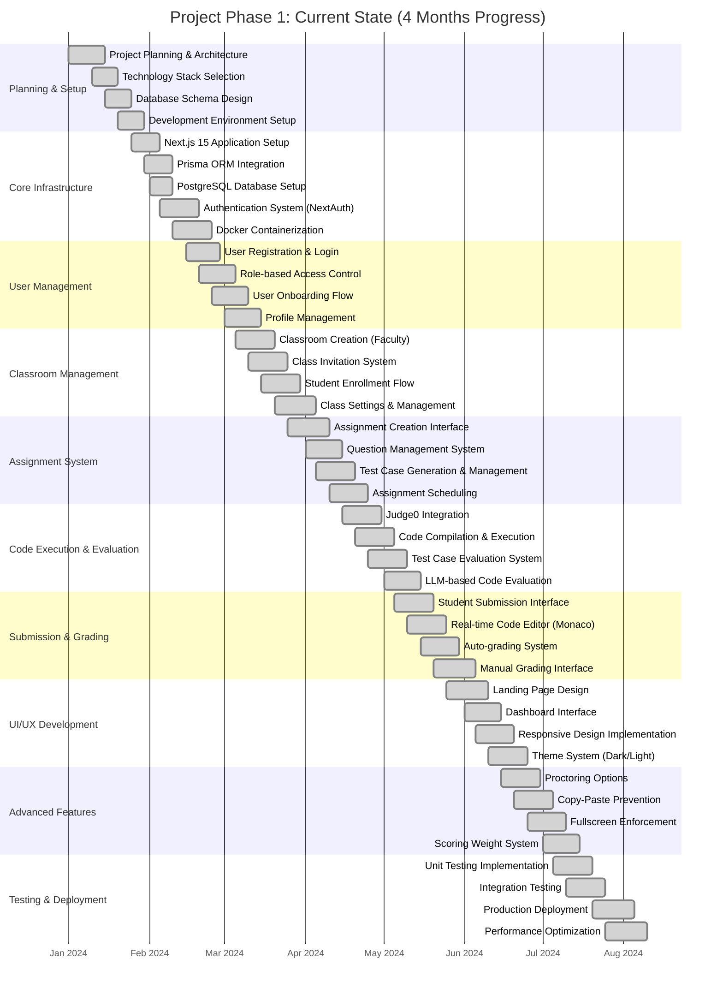

# Project Phase 1: Current State Gantt Chart

## Overview
This chart outlines the 4-month development progress of the GradeIt application, showing the completed features and their timeline.

## Key Achievements in Phase 1

### Core Features Implemented:
- **Complete Authentication System** with NextAuth.js
- **Role-based Access Control** (Faculty/Student roles)
- **Classroom Management** with invitation system
- **Assignment Creation & Management** with scheduling
- **Code Execution Engine** using Judge0 API
- **Auto-grading System** with test cases and LLM evaluation
- **Real-time Code Editor** with Monaco Editor
- **Proctoring Features** (copy-paste prevention, fullscreen enforcement)
- **Responsive UI** with dark/light theme support
- **Database Schema** with comprehensive relationships

### Technical Stack:
- **Frontend**: Next.js 15, React 19, TypeScript, Tailwind CSS
- **Backend**: Next.js API routes, Prisma ORM
- **Database**: PostgreSQL
- **Authentication**: NextAuth.js
- **Code Execution**: Judge0 API
- **AI Integration**: Groq AI for code evaluation
- **UI Components**: Radix UI, Framer Motion
- **Deployment**: Docker containerization