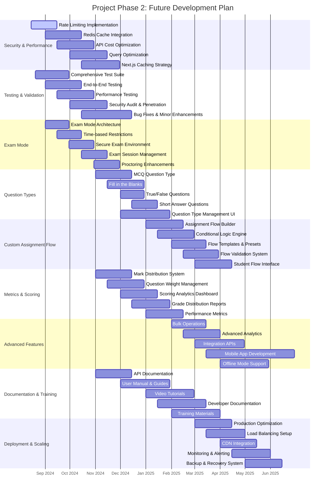

# Project Phase 2: Future Development Gantt Chart

## Overview
This chart outlines the planned future development phases for the GradeIt application, including all the requested features and enhancements.

## Priority Features (High Priority)

### 1. Rate Limiting Critical Endpoints
- **Timeline**: August 15 - September 15, 2024
- **Scope**: Implement rate limiting for authentication, submission, and evaluation endpoints
- **Technologies**: Redis, Express Rate Limit, or Next.js middleware

### 2. Testing and Validation
- **Timeline**: August 20 - December 15, 2024
- **Scope**: Comprehensive testing suite, E2E tests, performance testing
- **Technologies**: Jest, Playwright, Cypress, Lighthouse

### 3. Exam Mode
- **Timeline**: September 1 - November 30, 2024
- **Scope**: Secure exam environment with time restrictions and enhanced proctoring
- **Features**: Session management, time-based access, secure submission

### 4. Redis Cache Integration
- **Timeline**: September 1 - October 15, 2024
- **Scope**: Implement Redis caching to reduce API costs and improve performance
- **Benefits**: Reduced Judge0 API calls, faster response times, cost savings

### 5. Question Type Variety
- **Timeline**: November 1, 2024 - January 15, 2025
- **Scope**: Support for MCQ, fill-in-the-blanks, true/false, short answers
- **Priority**: High - Essential for comprehensive assessment platform

### 6. Custom Assignment Flow
- **Timeline**: January 1 - April 15, 2025
- **Scope**: Allow faculty to create custom assignment sequences
- **Examples**: Code → MCQ → Fill-in-the-blanks flow

### 7. Mark Distribution System
- **Timeline**: November 1 - December 15, 2024
- **Priority**: High - Students need to understand scoring breakdown
- **Features**: Question-level marks, section weights, total calculation

## Technical Enhancements

### Performance Optimizations
- **Query Optimization**: Database query performance improvements
- **Next.js Caching**: Strategic caching implementation
- **CDN Integration**: Content delivery network setup
- **Load Balancing**: Horizontal scaling capabilities

### Security Improvements
- **Rate Limiting**: API endpoint protection
- **Security Audit**: Comprehensive security review
- **Penetration Testing**: Vulnerability assessment
- **Data Encryption**: Enhanced data protection

### Scalability Features
- **Microservices Architecture**: Service decomposition
- **API Gateway**: Centralized API management
- **Database Sharding**: Data distribution strategy
- **Monitoring & Alerting**: System health tracking

## Success Metrics

### Performance Targets
- **API Response Time**: < 200ms for cached requests
- **Page Load Time**: < 2 seconds
- **Uptime**: 99.9% availability
- **Concurrent Users**: Support 1000+ simultaneous users

### Cost Optimization
- **API Cost Reduction**: 60-70% reduction through caching
- **Infrastructure Costs**: 30-40% reduction through optimization
- **Maintenance Overhead**: 50% reduction through automation

### User Experience
- **Mobile Responsiveness**: 100% mobile compatibility
- **Accessibility**: WCAG 2.1 AA compliance
- **User Satisfaction**: > 4.5/5 rating
- **Feature Adoption**: > 80% feature utilization